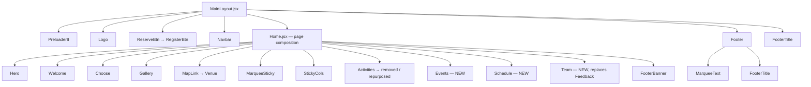
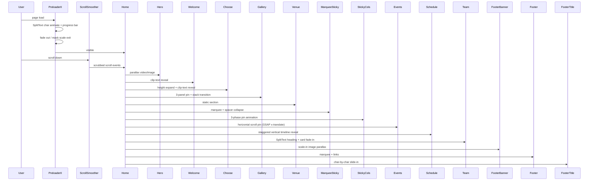

# Design Document: ELEVATE College Event Website

## Overview

Convert the existing "Capsules®" capsule hotel site into **ELEVATE** — a college tech-fest website for the **IEEE IEM Student Branch** — while preserving every GSAP animation, scroll interaction, and the dark robotic color scheme. Only content, branding, and two new sections (Events carousel, Schedule timeline, Team) are added or replaced; the underlying React + Vite + GSAP + Tailwind CSS v4 stack and all animation logic remain untouched.

The site is a single-page application rendered through `src/pages/Home/Home.jsx`, which composes all section components in order. New components follow the exact same GSAP patterns (`useGSAP`, `ScrollTrigger`, `SplitText`) already used throughout the codebase.

---

## Architecture



### Component Responsibility Map

| Layer | File | Change |
|---|---|---|
| Layout | `MainLayout.jsx` | None — structure preserved |
| Page | `Home.jsx` | Add Events, Schedule, Team imports; remove Activities; replace Feedback with Team |
| Preloader | `PreloaderII.jsx` | Text: "Capsule" → "ELEVATE"; footer tagline updated |
| Branding | `Logo.jsx` | No change (SVG logo kept) |
| CTA | `ReserveBtn.jsx` | Label "Reverse" → "Register"; href → `#register` |
| Hero | `Hero.jsx` | Title, subtitle, description updated |
| Welcome | `Welcome.jsx` | Reads from `constants/welcome.js` (updated) |
| Choose | `Choose.jsx` | Reads pill tags from JSX (inline update) |
| Gallery | `Gallery.jsx` | Labels only ("ClassicCapsule®" → venue names) |
| Venue | `MapLink.jsx` | College address replaces map link |
| MarqueeSticky | `MarqueeSticky.jsx` | Subtitle copy updated |
| StickyCols | `StickyCols.jsx` | Content text updated; images kept |
| Activities | `Activities.jsx` | Removed from `Home.jsx` composition |
| Events | `Events.jsx` (**NEW**) | 12-event GSAP horizontal scroll carousel |
| Schedule | `Schedule.jsx` (**NEW**) | Vertical timeline with scroll reveal |
| Team | `Team.jsx` (**NEW**, replaces Feedback) | Team/organizer section |
| FooterBanner | `FooterBanner.jsx` | Title, subtitle, description updated |
| Footer | `Footer.jsx` | Nav links, copy, social icons updated |
| FooterTitle | `FooterTitle.jsx` | "Capsules®" → "ELEVATE" |
| Marquee | `MarqueeText.jsx` | "Why Capsules®?" → "Why ELEVATE?" |

---

## Sequence Diagram — Page Load & Scroll Flow



---

## Components and Interfaces

### 1. Hero

**File**: `src/components/Hero/Hero.jsx`  
**Change type**: Content only  

**Updated content**:
- Main title: **ELEVATE**
- Subtitle lines: `"India's Premier"`, `"College Tech-Fest—"`, `"IEEE IEM SB"`
- Body copy: `"Join thousands of innovators, engineers, and creators at ELEVATE — powered by IEEE IEM Student Branch."`
- The smoke video background, parallax `scrollTrigger` on `.hero-img`, and mobile fallback image remain structurally identical.

**Register CTA integration** — The floating `ReserveBtn` in `MainLayout.jsx` gets its label updated to "Register" and its href to `#register`.

---

### 2. Welcome / About

**File**: `src/components/Welcome/Welcome.jsx` + `src/constants/welcome.js`  
**Change type**: Constants update only  

New `welcomeLinesLG`:
```
"Step into the future of technology at",
"ELEVATE — IEEE IEM Student Branch's",
"flagship tech-fest, where innovation",
"meets competition. Explore robotics,",
"AI, circuits, and more across",
"two days of electrifying events."
```

New `welcomeLinesSM`: equivalent mobile-broken version  
New `chooseLinesLG`: `["Choose your", "event"]`  
New `chooseLinesSM`: `["Choose", "your", "event"]`

The `clip-text` scroll-scrub animation in `Welcome.jsx` is entirely preserved.

---

### 3. Choose / Theme

**File**: `src/components/Choose/Choose.jsx`  
**Change type**: Inline copy + pill tags  

- Subtitle: `"Explore ELEVATE Themes"`
- Body paragraph: describes the robotic theme and available event categories
- Pill tags (robotic theme):

```
Autonomous | AI-Powered | IEEE Certified
Circuit Design | Drone Tech | Human vs Machine
Open Innovation | Hackathon Ready
```

Tags alternate between `border-[#b1a696]` (muted) and `border-[#f4efe7]` (light) as in the original. All GSAP animations (height expand, clip-text reveal, slide-in) preserved unchanged.

---

### 4. Gallery — Venue Atmosphere

**File**: `src/components/Gallery/Gallery.jsx`  
**Change type**: Label strings only  

| Panel | Original label | New label |
|---|---|---|
| 1 | ClassicCapsule® | Main Arena |
| 2 | Terrace Capsule® | Lab Complex |
| 3 | Desert Capsule® | Expo Hall |

Gallery description text updated to reflect venue/atmosphere instead of hotel rooms. The 3-panel scroll-pin animation (`pin: true`, `scrub: 1`, stacked transform transitions) is fully preserved. The repeating ticker in `.gallery-slider` changes from `"Capsules®"` to `"ELEVATE"`.

---

### 5. Venue (replaces MapLink)

**File**: `src/components/MapLink/MapLink.jsx`  
**Change type**: Copy replacement  

```
Subtitle:  "Find us on campus"
Heading:   "ELEVATE is hosted at"
           "Institute of Engineering"
           "& Management, Kolkata"
Link text: "Salt Lake, Sector V, WB 700091"
```

The hover `ClickIndicator` and the `useState` active-link pattern are preserved. The `href` points to `#register` (placeholder for Google Maps).

---

### 6. MarqueeSticky

**File**: `src/components/Layouts/MarqueeSticky.jsx`  
**Change type**: Subtitle copy only  

```
"Want to know why ELEVATE"
"is the event of the year?"
```

The spacer-collapse animation and marquee-none overlay logic are unchanged.

**File**: `src/components/Marquee/MarqueeText.jsx`  
**Change type**: Marquee text only  

```
"Why ELEVATE?★"   (replaces "Why Capsules®?*")
```

---

### 7. StickyCols — Why Attend

**File**: `src/components/StickyCols/StickyCols.jsx`  
**Change type**: Text content in col-1, col-3 wrappers  

| Slot | Original | New |
|---|---|---|
| col-1 heading | "Enjoy the view through—the wide panoramic glass window" | "Compete, create,—and connect with the best minds in tech" |
| col-3 heading (wrapper 1) | same | "Hands-on workshops—and live demo zones await you" |
| col-3 heading (wrapper 2) | same | "Win prizes,—earn recognition, build your portfolio" |
| All `p` descriptions | desert-related | ELEVATE event experience copy |

Counter pills (`1/3`, `2/3`, `3/3`) preserved. All 3-phase pin animation (col-2 reveal, col-3 phase switch) preserved.

---

### 8. Events Carousel (NEW)

**File**: `src/components/Events/Events.jsx`  
**Data**: `src/constants/events.js`  

Reuses the **exact same GSAP ScrollTrigger horizontal scroll pin pattern** from `Showcase.jsx`:

```
scrollTrigger: {
  trigger: containerRef,
  start: "-10% 10%",
  end: `+=${totalWidth}`,
  scrub: true,
  pin: true,
}
gsap.to(imgConRef, { x: -totalWidth, ease: "none", ... })
```

**Card layout** (each of 12 cards, `w-[70vw]` or responsive):

```
┌─────────────────────────────────────────┐
│  [Category badge]          [Difficulty] │
│                                          │
│  Event Name (large, bold)               │
│                                          │
│  Brief description (2–3 lines)          │
│                                          │
│  [01 / 12]                              │
└─────────────────────────────────────────┘
```

- Category badge: `"Technical"` (accent `#f4efe7`) or `"Non-Technical"` (muted `#b1a696`), bordered pill
- Difficulty badge: top-right bordered pill (e.g., `"Advanced"`, `"Open"`)
- Background: `#2a2725` rounded card (`rounded-[2.5rem]`)
- Card counter: bottom-left `01 / 12` style matching Showcase's `01 / 03` pattern

**Data interface**:

```typescript
interface Event {
  id: number           // 1–12
  name: string
  category: "Technical" | "Non-Technical"
  description: string
  difficulty: "Beginner" | "Intermediate" | "Advanced" | "Open"
}
```

---

### 9. Schedule Timeline (NEW)

**File**: `src/components/Schedule/Schedule.jsx`  
**Data**: `src/constants/schedule.js`  

**Visual layout**: vertical timeline, centered spine line, alternating left/right items on desktop, stacked on mobile.

**GSAP animation**: staggered scroll reveal using `ScrollTrigger` (no pin), each item animates from `opacity: 0, x: ±60` to final position as it enters viewport:

```
scrollTrigger: {
  trigger: ".schedule-section",
  start: "top 80%",
  end: "bottom 20%",
  scrub: 1
}
gsap.from(".schedule-item", { opacity: 0, x: ±60, stagger: 0.15 })
```

**Data interface**:

```typescript
interface ScheduleItem {
  time: string      // "9:00 AM"
  title: string     // "Registration & Check-in"
  icon?: string     // optional emoji accent
}
```

---

### 10. Team Section (NEW — replaces Feedback)

**File**: `src/components/Team/Team.jsx`  
**Data**: `src/constants/team.js`  

**Reuses the Feedback component's structure** (prev/next navigation, progress bar) but repurposed for team member/organizer display. Since no individual member photos exist yet, the section is simplified to:

- Section subtitle: `"Meet the team"`
- Large animated heading: `"Team ELEVATE"` (SplitText reveal on scroll)
- Organizer badge: `"Organized by IEEE IEM Student Branch"`
- A placeholder grid for team member cards (name, role) — data-driven from `constants/team.js`
- No image dependency initially; avatar placeholder circles used

**Animation**: SplitText char-by-char on the heading, fade-in stagger on cards, matching the existing `Feedback` scroll entrance style.

---

### 11. FooterBanner

**File**: `src/components/FooterBanner/FooterBanner.jsx`  
**Change type**: Copy only  

```
Title:      ELEVATE
Subtitle:   "Register—Now"  /  "Level Up"
Body copy:  "Join ELEVATE — IEEE IEM Student Branch's flagship tech-fest."
```

CTA area updated with "Register Now" link to `#register`. The scale-parallax `scrollTrigger` animation on the background image is preserved.

---

### 12. Footer

**File**: `src/components/Footer/Footer.jsx`  
**Change type**: Nav links, copy, social icons  

Updated nav links:
```
About | Events | Schedule | Team | Venue | Register
```

Body copy:
```
"ELEVATE — powered by IEEE IEM Student Branch.
 A celebration of technology, innovation, and community."
```

Social icons: `FaInstagram`, `CiLinkedin`, `FaYoutube`, `FaTwitter` (swap Behance/Dribbble for Twitter/YouTube — relevant for an IEEE student branch).

Footer tagline (bottom-right):
```
"ELEVATE — IEEE IEM Student Branch's flagship tech-fest."
```

---

### 13. FooterTitle

**File**: `src/components/Footer/FooterTitle.jsx`  
**Change type**: Text only  

```
h1 content:  ELEVATE
sub removed (no ® symbol needed)
```

Top bar text:
```
Left:   "Powered by—IEEE IEM Student Branch"
Center: "© ELEVATE 2025"
Right:  "All rights reserved"
```

The char-by-char `SplitText` slide-in animation is fully preserved.

---

### 14. Preloader

**File**: `src/components/Preloader/PreloaderII.jsx`  
**Change type**: Text only  

```
h1 in .preloader-logo:   "ELEVATE"
.preloader-footer p:     "ELEVATE — IEEE IEM Student Branch's\nflagship college tech-fest."
```

All SplitText char/line animations preserved exactly.

---

## Data Models

### `src/constants/events.js`

```javascript
export const eventsData = [
  { id: 1,  name: "Robo Wars",         category: "Technical",     description: "Battle your robot against opponents in an arena combat challenge. Build the toughest machine and dominate the ring.", difficulty: "Advanced" },
  { id: 2,  name: "Line Follower",     category: "Technical",     description: "Program an autonomous robot to follow a line track at maximum speed with precision and reliability.",               difficulty: "Intermediate" },
  { id: 3,  name: "Maze Solver",       category: "Technical",     description: "Design a robot that can autonomously navigate and solve a complex maze with the shortest possible path.",          difficulty: "Advanced" },
  { id: 4,  name: "Robo Soccer",       category: "Technical",     description: "Head-to-head robot football. Maneuver your bot to score goals and outplay your opponent in 2-minute matches.",    difficulty: "Intermediate" },
  { id: 5,  name: "Drone Racing",      category: "Technical",     description: "Pilot FPV drones through obstacle courses at high speed. Fastest lap time wins.",                                  difficulty: "Advanced" },
  { id: 6,  name: "Circuit Design",    category: "Technical",     description: "Solve PCB layout and circuit design challenges under time pressure. Test your electronics fundamentals.",          difficulty: "Intermediate" },
  { id: 7,  name: "AI Hackathon",      category: "Technical",     description: "Build an AI/ML solution to a real-world problem in 4 hours. Any language, any framework.",                       difficulty: "Open" },
  { id: 8,  name: "Paper Presentation",category: "Non-Technical", description: "Present your research paper or technical concept to a panel of judges. Innovation and clarity rewarded.",        difficulty: "Open" },
  { id: 9,  name: "Project Exhibition",category: "Non-Technical", description: "Showcase your project — hardware or software — to visitors and judges. Best project wins.",                      difficulty: "Open" },
  { id: 10, name: "Quiz",              category: "Non-Technical", description: "Fast-paced technical quiz covering robotics, AI, electronics, and general science. Team of 2.",                  difficulty: "Beginner" },
  { id: 11, name: "Photography",       category: "Non-Technical", description: "Capture the energy and spirit of ELEVATE through your lens. Best photo wins across categories.",                 difficulty: "Open" },
  { id: 12, name: "Gaming",            category: "Non-Technical", description: "Compete in the esports tournament. Titles to be announced. Solo and team formats available.",                   difficulty: "Open" },
];
```

### `src/constants/schedule.js`

```javascript
export const scheduleData = [
  { time: "9:00 AM",  title: "Registration & Check-in",               icon: "⚙️" },
  { time: "10:00 AM", title: "Inauguration Ceremony",                  icon: "🤖" },
  { time: "11:00 AM", title: "Technical Events — Round 1",             icon: "🔬" },
  { time: "1:00 PM",  title: "Lunch Break",                            icon: "☕" },
  { time: "2:00 PM",  title: "Technical Round 2 + Non-Technical Events",icon: "⚡" },
  { time: "5:00 PM",  title: "Project Exhibition & AI Hackathon",      icon: "🏗️" },
  { time: "7:00 PM",  title: "Prize Distribution & Closing Ceremony",  icon: "🏆" },
];
```

### `src/constants/team.js`

```javascript
export const teamData = {
  teamName: "Team ELEVATE",
  organizer: "IEEE IEM Student Branch",
  tagline: "Building tomorrow's engineers, today.",
  members: [
    { name: "Placeholder Name", role: "Event Director" },
    { name: "Placeholder Name", role: "Technical Lead" },
    { name: "Placeholder Name", role: "Design Lead" },
    { name: "Placeholder Name", role: "Logistics Head" },
    { name: "Placeholder Name", role: "Sponsorship" },
    { name: "Placeholder Name", role: "Marketing" },
  ]
};
```

### Updated `src/constants/welcome.js`

```javascript
export const welcomeLinesLG = [
  "Step into the future of technology at",
  "ELEVATE — IEEE IEM Student Branch's",
  "flagship tech-fest, where innovation",
  "meets competition. Explore robotics,",
  "AI, circuits, and more across",
  "two days of electrifying events.",
];
export const welcomeLinesSM = [
  "Step into the future",
  "of technology at",
  "ELEVATE — IEEE IEM",
  "Student Branch's",
  "flagship tech-fest,",
  "where innovation",
  "meets competition.",
  "Explore robotics,",
  "AI, circuits, and",
  "more across two days",
  "of electrifying",
  "events.",
];
export const chooseLinesLG = ["Choose your", "event"];
export const chooseLinesSM = ["Choose", "your", "event"];
```

---

## Error Handling

### GSAP Ref Guards

All new components follow the existing pattern of guarding refs before animating:

```javascript
useGSAP(() => {
  if (!containerRef.current || !innerRef.current) return;
  // animation code
}, { scope: containerRef });
```

### Missing Data Fallback

Events and Schedule components render only if their respective data arrays are non-empty; a null/empty state renders nothing (no crash).

### Image Assets

New sections (Events, Schedule, Team) use no image assets initially — cards rely on CSS backgrounds (`#2a2725`) and text. This avoids broken-image states while placeholders are pending.

---

## Testing Strategy

### Unit Testing Approach

Each new component (`Events`, `Schedule`, `Team`) should be testable in isolation:
- Verify correct number of event cards rendered from `eventsData`
- Verify schedule items render in correct order
- Verify team member count from `teamData.members`

### Property-Based Testing Approach

Not applicable for this primarily presentational conversion. Animation behavior is tested visually.

**Property Test Library**: Not required for this spec — visual/integration testing preferred.

### Integration Testing Approach

- Run `npm run dev` (Vite dev server) and manually verify:
  1. Preloader animates with "ELEVATE" text
  2. Hero shows ELEVATE branding
  3. Events carousel horizontal scroll works (12 cards, GSAP pin)
  4. Schedule timeline items animate on scroll
  5. Team section renders without images
  6. FooterTitle shows "ELEVATE" with char animation
  7. No console errors from GSAP (no missing `.image-item` targets, etc.)

---

## Performance Considerations

- All new GSAP timelines use `scrub: true` (scroll-linked) — no per-frame JS loops
- Events carousel: same lazy evaluation as Showcase (`totalWidth` computed once via `scrollWidth`)
- Schedule: staggered reveal uses a single `ScrollTrigger` instance, not one per item
- No new external image dependencies for Events/Schedule/Team to avoid extra network requests

---

## Security Considerations

- All external links use `href="#register"` as placeholder; no third-party tracking embeds
- No user input forms in scope — registration is an external link
- Social icon hrefs are `"#"` placeholders; should be replaced with actual IEEE IEM social URLs before deployment

---

## Dependencies

No new npm dependencies required. All capabilities are covered by the existing stack:

| Dependency | Version | Usage |
|---|---|---|
| react | 19 | Component rendering |
| gsap | latest (club) | ScrollTrigger, SplitText, useGSAP |
| tailwindcss | v4 | Utility styling |
| react-icons | latest | Social + UI icons (FaYoutube, FaTwitter added) |
| react-responsive | latest | Mobile breakpoint detection |
| @studio-freight/lenis | latest | Smooth scroll |
| react-router-dom | v7 | Routing (unchanged) |
